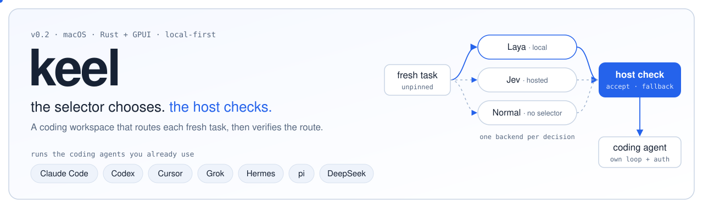

  

  <b>A local-first macOS coding workspace.</b> Keel runs the coding agents you already use. 
  A <b>local Laya selector</b> or an optional <b>hosted Jev selector</b> chooses a route. The host checks each choice before Keel applies it.

  <a href="docs/guide.md">Getting started</a> ·
  <a href="docs/build.md">Build from source</a> ·
  <a href="docs/decision-architecture.md">Architecture</a> ·
  <a href="#roadmap">Roadmap</a> ·
  <a href="docs/README.md">All documentation</a>

---

Keel 0.2.0 puts the editor workspace, provider connections, task routing, and decision records into one Rust/GPUI app. It uses an Avid-derived interface.

## features

**Workspace**
- Sessions, a composer, a transcript, a terminal, a changes view, and settings in one native window.
- **Agent graph (new).** Press <kbd>⇧⌘G</kbd> to see each active session as an agent node, its subagents as child nodes, and the files it reads or writes as shared context nodes. Select a node to steer or stop its agent. Double-click an agent to open its session.
- Image attachments and macOS Dictation in the composer.
- A git history pane with a commit lane graph beside the changes view.
- Crash recovery: an append-only run journal replays live streams and marks interrupted runs.

**Coding agents**
- Claude Code, Codex, Cursor, Grok, Hermes, and pi through the Agent Client Protocol (ACP).
- An embedded DeepSeek agent loop that runs in process, with host-enforced tool focus.
- Each provider keeps its own authentication, model configuration, and tool loop.
- Subagent spawns show as `Task` calls, including Grok's `spawn_subagent`.
- Installed Codex Computer Use MCP tools reach compatible ACP sessions.

**Decisions**
- Laya (local, Core ML) or Jev (hosted, opt-in) chooses an eligible route for a **fresh, unpinned task**, or abstains.
- The host validates every choice. A rejected, stale, or expired choice falls back to the ordinary route.
- Each decision leaves a bounded receipt in the transcript: candidates, result, validation, fallback, and observed outcome.
- **Decision export (new).** `keel decisions export` writes one replay case per receipt as JSONL.
- **Decision report (new).** `keel decisions report` prints counts by backend, stage, and validation, plus fallback and confidence figures.

**Operations**
- `keel headless` runs the engine without a UI. `keel daemon install` runs it as a background service.
- `keel status` and `keel laya status` show the workspace, the saved mode, and the model state.
- One engine owns one data directory. A second engine stops with a clear error.

Pinned routes and live or resumed sessions keep their existing route. External ACP agents keep their own internal tool loops.

## choose a decision mode

| Mode | Runs where | Requires | What happens |
| --- | --- | --- | --- |
| Laya — default | Locally through Core ML | Worker and pinned checkpoint | Selects from host-prepared candidates, or abstains. |
| Jev — opt-in | Hosted by TypeSafe | Existing protected local credential | Sends a bounded decision request directly to TypeSafe. |
| Normal | No selector call | Your coding provider setup | Uses the ordinary harness route. |

Exactly one backend runs per decision. **A local selector does not mean your coding worker runs locally.** Each coding provider keeps its own authentication and model configuration.

## get started

1. Use Apple Silicon with macOS 15 or later for the packaged Laya model.
2. [Build from source](docs/build.md), or use a local development package you already have. This repository does not currently publish downloadable app releases.
3. Open Keel and choose **Local Laya**, **Jev**, or **Normal harness**.
4. Open **Settings → Accounts** to inspect installed coding CLIs, then **Settings → Agents** to configure available adapters.
5. Choose a provider and model, then start a task.

The light package downloads Laya only when you choose **Download and activate Laya**. While it downloads, the ordinary harness works and the Laya preference stays saved. The full package already contains the pinned checkpoint.

See the [user guide](docs/guide.md) for setup, status commands, and troubleshooting.

## what this build does not claim

- Decision records support evaluation; **automatic training is not implemented**.
- Build checks do not establish better coding outcomes. See the dated [build report](docs/archive/build-report-0.2.0.md).
- External ACP tools do not all pass through Laya or Jev.
- `keel computer-use decide` selects a prepared action ID; it does not click or type.
- Voice input uses macOS Dictation. Native Codex realtime voice and cloud sync are absent.
- App packages are ad hoc signed development builds. Public installer distribution still needs Developer ID signing and notarization.

## find your way through the source

The application and its runtime dependencies live in `apps/` and `crates/`.
Optional imported libraries are in [`extras/`](extras/README.md); diagnostic
programs and maintenance utilities are in [`tools/`](tools/README.md).
See the [developer guide](docs/development.md) for the complete layout and checks.

| Start here | Responsibility |
| --- | --- |
| [`apps/keel`](apps/keel) | App entry point and local CLI. |
| [`crates/ui`](crates/ui) | Workspace, onboarding, settings, and appearance. |
| [`decision_mode.rs`](crates/engine/src/decision_mode.rs) | Saved mode and available decision backend. |
| [`jev_routing.rs`](crates/engine/src/jev_routing.rs) | Eligible route candidates and validation. |
| [`decision_log.rs`](crates/engine/src/decision_log.rs) | Read-only receipt export and report. |
| [`agent_graph.rs`](crates/ui/src/agent_graph.rs) | Agent graph view. |
| [`crates/harness`](crates/harness) | Local ACP adapters and installed computer-use MCP discovery. |
| [`crates/laya-local`](crates/laya-local) | Local Core ML worker integration. |
| [`crates/jev-core`](crates/jev-core) | Typed decision requests and direct TypeSafe client. |
| [`agent.rs`](crates/dsh/agent-loop/src/agent.rs) | Embedded DeepSeek loop and tool-dispatch checks. |

A plain `cargo build` or `cargo run` selects Keel. Use `cargo test --workspace`
to check all packages, including optional libraries and the standalone CLI.

## roadmap

The roadmap follows the [improvement loop](docs/proposals/improvement-loop.md): record decisions, replay them, compare, and let a human approve the change. Items move up only when they have code and a test.

**Shipped in this update**
- [x] Agent graph: agents, subagents, and shared files in one view, with steer and stop (<kbd>⇧⌘G</kbd>).
- [x] `keel decisions export`: one replay case per decision receipt, as JSONL (loop step 1).
- [x] `keel decisions report`: selected, abstained, fallback, validation, and confidence counts.

**Next**
- [ ] `keel decisions replay`: run a baseline and one candidate on the same exported cases (loop steps 2–3).
- [ ] Held-out case sets and a side-by-side comparison report (loop step 4).
- [ ] A decision report panel in **Settings**, with the same numbers as the CLI.
- [ ] A `--profile` option, so export and report can read synced profiles.
- [ ] Agent graph: a warning when two agents write the same file.
- [ ] A Jev key-entry screen in **Settings → Agents**.

**Later**
- [ ] Developer ID signing, notarization, and downloadable releases.
- [ ] Computer-use actions that run only after a host confirmation.
- [ ] Native Codex realtime voice.
- [ ] Optional cloud sync from the source-only `cloud-connect` crate.

## evidence and next steps

Read the [architecture](docs/decision-architecture.md) for the implemented boundaries, the [build report](docs/archive/build-report-0.2.0.md) for recorded checks, and the [improvement-loop proposal](docs/proposals/improvement-loop.md) for the evaluation work still needed.

The separate [Jev Engineering repository](https://github.com/codejunkie99/jev-engineering) contains the framework, paper, and examples. The [article source index](docs/archive/article-sources-0.2.0.md) points to this application's source and build documents.

## credits and licenses

Keel retains the source notices for its Avid-derived UI and embedded DeepSeek components. Local inference uses [Laya](https://github.com/NandhaKishorM/laya) and the [Laya Core ML runtime](https://github.com/mizorewww/laya-coreml).

See [LICENSE](LICENSE), [UI license](licenses/LICENSE.ui-base), [DeepSeek license](licenses/LICENSE.deepseek-harness), [Laya runtime license](licenses/LICENSE.laya-coreml), and the [third-party notices](THIRD_PARTY_NOTICES.md).
