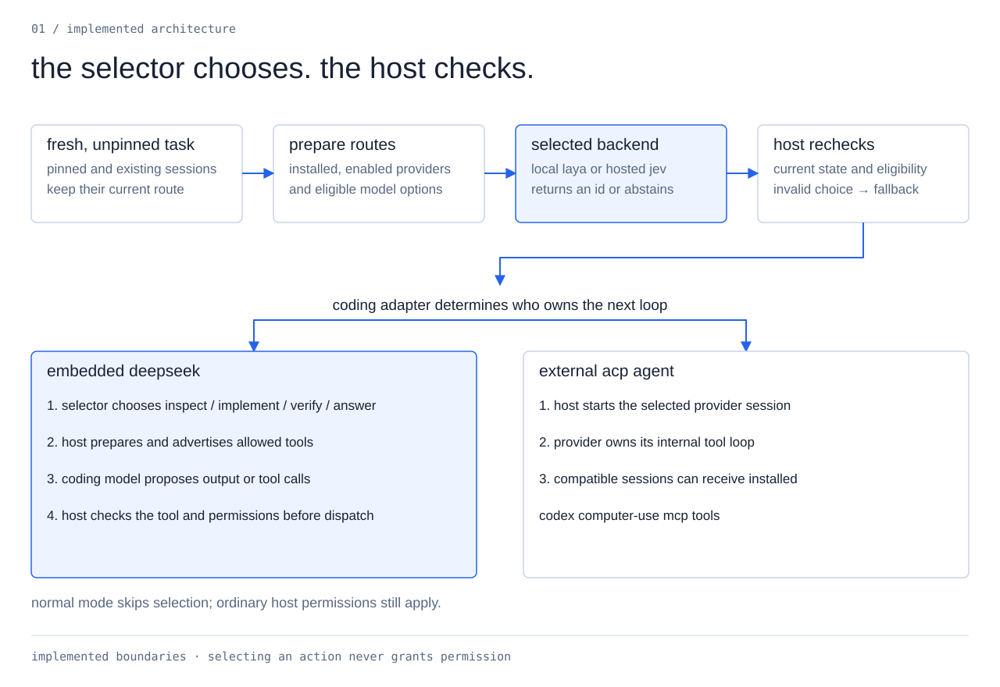
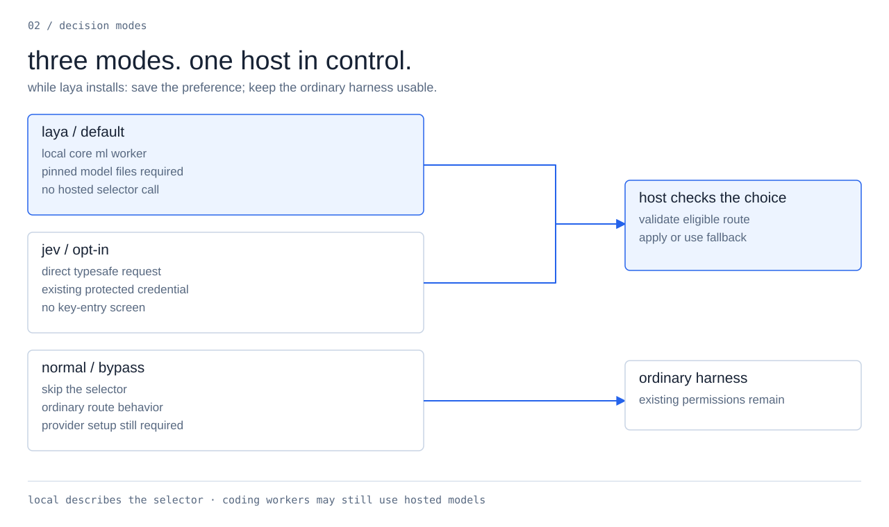

# keel

A local-first macOS coding workspace with a **local Laya selector**, optional **hosted Jev**, and host-owned permission checks.

Keel 0.2.0 brings the editor workspace, provider connections, task routing, and decision records into one Rust/GPUI app. It uses an Avid-derived interface.

**The selector chooses from allowed options. Keel checks the choice before applying it.**

[Getting started](docs/guide.md) · [Build from source](docs/build.md) · [Architecture](docs/decision-architecture.md) · [All documentation](docs/README.md)

---

## what you can do

- Work with sessions, a composer, transcript, terminal, changes view, and settings.
- Connect supported coding agents through the Agent Client Protocol (ACP).
- Let Laya or Jev choose an eligible route for a **fresh, unpinned task**.
- Use bounded tool-focus selection inside the embedded DeepSeek loop.
- Inspect selector activity, accepted choices, abstentions, and fallbacks.

Pinned routes and live or resumed sessions keep their existing route. External ACP agents retain their own internal tool loops.

## choose a decision mode

| Mode | Runs where | Requires | What happens |
| --- | --- | --- | --- |
| Laya — default | Locally through Core ML | Worker and pinned checkpoint | Selects from host-prepared candidates, or abstains. |
| Jev — opt-in | Hosted by TypeSafe | Existing protected local credential | Sends a bounded decision request directly to TypeSafe. |
| Normal | No selector call | Your coding provider setup | Uses the ordinary harness route. |

Exactly one backend runs per decision. **A local selector does not mean your coding worker runs locally.** Each coding provider keeps its own authentication and model configuration.

## get started

1. Use Apple Silicon with macOS 15 or later for the packaged Laya model.
2. [Build from source](docs/build.md), or use a local development package you already have. This repository does not currently publish downloadable app releases.
3. Open Keel and choose **Local Laya**, **Jev**, or **Normal harness**.
4. Open **Settings → Accounts** to inspect installed coding CLIs, then **Settings → Agents** to configure available adapters.
5. Choose a provider and model, then start a task.

The light package downloads Laya only when you choose **Download and activate Laya**. While it downloads, the ordinary harness works and the Laya preference stays saved. The full package already contains the pinned checkpoint.

See the [user guide](docs/guide.md) for setup, status commands, and troubleshooting.

## what this build does not claim

- Decision records support evaluation; **automatic training is not implemented**.
- Build checks do not establish better coding outcomes. See the dated [build report](docs/build-report.md).
- External ACP tools do not all pass through Laya or Jev.
- `keel computer-use decide` selects a prepared action ID; it does not click or type.
- Voice input uses macOS Dictation. Native Codex realtime voice and cloud sync are absent.
- App packages are ad hoc signed development builds. Public installer distribution still needs Developer ID signing and notarization.

## find your way through the source

| Start here | Responsibility |
| --- | --- |
| [`apps/keel`](apps/keel) | App entry point and local CLI. |
| [`crates/ui`](crates/ui) | Workspace, onboarding, settings, and appearance. |
| [`decision_mode.rs`](crates/engine/src/decision_mode.rs) | Saved mode and available decision backend. |
| [`jev_routing.rs`](crates/engine/src/jev_routing.rs) | Eligible route candidates and validation. |
| [`crates/harness`](crates/harness) | Local ACP adapters and installed computer-use MCP discovery. |
| [`crates/laya-local`](crates/laya-local) | Local Core ML worker integration. |
| [`crates/jev-core`](crates/jev-core) | Typed decision requests and direct TypeSafe client. |
| [`agent.rs`](crates/dsh/agent-loop/src/agent.rs) | Embedded DeepSeek loop and tool-dispatch checks. |

## evidence and next steps

Read the [architecture](docs/decision-architecture.md) for the implemented boundaries, the [build report](docs/build-report.md) for recorded checks, and the [improvement-loop proposal](docs/improvement-loop.md) for the evaluation work still needed.

The separate [Jev Engineering repository](https://github.com/codejunkie99/jev-engineering) contains the framework, paper, and examples. The [article source index](docs/article-sources.md) points to this application's source and build documents.

## credits and licenses

Keel retains the source notices for its Avid-derived UI and embedded DeepSeek components. Local inference uses [Laya](https://github.com/NandhaKishorM/laya) and the [Laya Core ML runtime](https://github.com/mizorewww/laya-coreml).

See [LICENSE](LICENSE), [UI license](LICENSE.ui-base), [DeepSeek license](LICENSE.deepseek-harness), [Laya runtime license](LICENSE.laya-coreml), and the [third-party notices](THIRD_PARTY_NOTICES.md).
