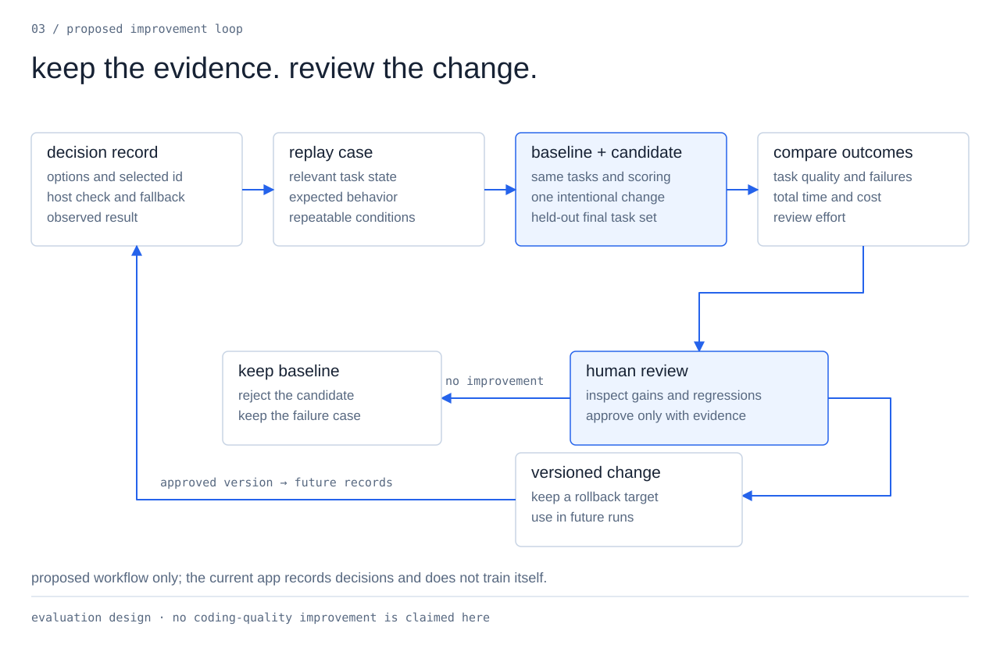

# proposed improvement loop

[Documentation](README.md) / improvement loop

**This is a proposal. Keel records decisions; it does not automatically train itself or deploy learned changes.**

## what exists today

The application records bounded choices, selector results, host validation, fallbacks, and observed outcomes. Those records give an evaluation a concrete starting point.

See [decision architecture](decision-architecture.md) for the implemented boundaries and [build evidence](build-report.md) for the recorded checks.

## what to build next

1. Turn a failure into a replay case with the relevant options, task state, selected ID, and expected behavior.
2. Run the baseline and one candidate change under the same conditions.
3. Compare valid choices, failures, abstention, fallback, task quality, total time, and review effort.
4. Check a separate task set that was not used during tuning.
5. Have a human review the evidence before adopting the change.
6. Keep the old version and a rollback path.

Candidate changes can affect prompts, candidate-construction rules, fallback policy, tool bundles, or the selector model.

## what counts as improvement

A valid ID proves that a response fits the contract. It does not prove that the route improved the code.

To claim better coding outcomes, define the task set and scoring rules, compare with the ordinary harness, and account for changes to workers, prompts, repositories, and reviewers.

A passing build, fast selector call, or successful demo alone does not establish that result.

## keep the review visible

Record the changed version, comparison results, approval, and rollback target. A human-approved change should leave evidence another person can inspect.

No automatic learning or coding-quality gain is claimed by this document.
